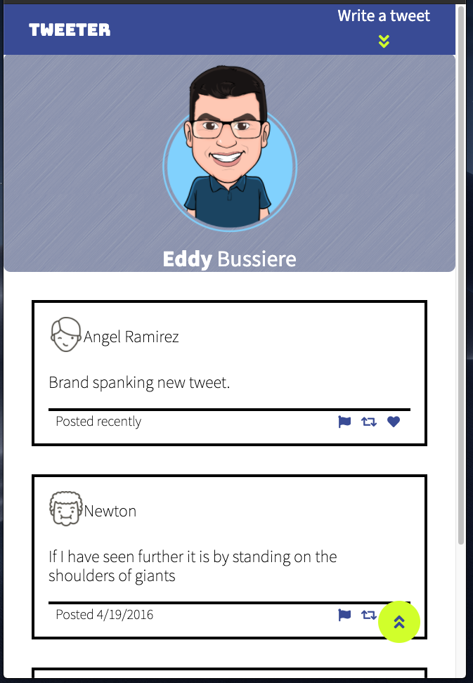

# Tweeter Project

Tweeter is a simple, single-page Twitter clone.

## When the app is started you can:

- Browse existing tweets listed with the most recent at the top.
- If you would like to tweet, press the "Write a tweet" icon in the navigation menu.
- The yellow button at the lower right hand corner of the screen will scroll to the top of the existing tweets list allowing you to enter a new tweet.

## Mobile layout



## Desktop Layout


## Dependencies

- chance
- express
- md5
- luxon.js
- Node.js
- Express
- body-parser

## Getting Started

- Install all dependencies listed above
```bash
npm install
```
- Run the development web server 
```bash
node express_server.js
```
or to run using nodemon
```bash
npm start
```
App runs at: http://localhost:8080/

## TODO

1. Implement SASS and clean up the css.
2. Implement a log in system as well as a storage solution.
3. Provide code comments for future developers/maintenance. 
4. Publish to Azure.


